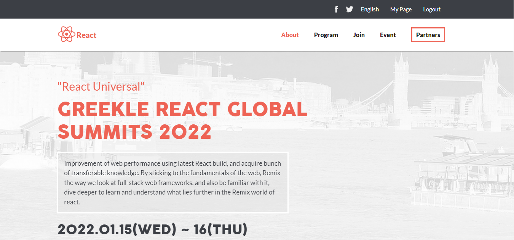

# 📗 Table of Contents

- [📖 About the Project](#about-project)
  - [🛠 Built With](#built-with)
    - [Tech Stack](#tech-stack)
    - [Key Features](#key-features)
  - [🚀 Live Demo](#live-demo)
- [💻 Getting Started](#getting-started)
  - [Setup](#setup)
  - [Prerequisites](#prerequisites)
  - [Usage](#usage)
- [👥 Authors](#authors)
- [🔭 Future Features](#future-features)
- [🤝 Contributing](#contributing)
- [⭐️ Show your support](#support)
- [🙏 Acknowledgements](#acknowledgements)
- [❓ FAQ](#faq)
- [📝 License](#license)


# 📖 [Greekle React Global Summits Website] <a name="about-project"></a>

> This is my first capstone project at microvesre after rounding up the portal section, The greekle online global summits website holds a virtual event where speakers who are leading expert from all over the world share ideas on how to solve challanges from work using react, greekle has the unique experience to gather huge tech summits with 10'000+ attendees in different tech domains.

## Desktop Preview



## Mobile Preview


## Learning objectives

- Understand how to use medium-fidelity wireframes to create a UI.
- Follow written requirements (e.g. user stories).
- Use semantic HTML tags.
- Apply best practices in HTML code.
- Use CSS selectors correctly.
- Use CSS box model.
- Use Flexbox to place elements in the page.
- Use images and backgrounds to enhance the look of a website.
- Demonstrate ability to create UIs adaptable to different screen sizes using media queries.
- Use GitHub Pages to deploy web pages.
- Apply JavaScript best practices and language style guides in code.
- Use JavaScript to manipulate DOM elements.
- Use JavaScript events.
- Use objects to store and access data.
- Communicate technical concepts to other technical people.

## 🛠 Built With <a name="built-with"></a>

- HTML (Hypertext Markup Language)

- CSS (Cascading Style Sheets)

- Js (JavaScript)

## Technologies used

- Github

- Git

- WebHint

- Stylelint

- ESlint

### Key Features <a name="key-features"></a>

- **[Gather huge tech summits with 10'000+ attendees in different tech domains.]**
- **[Gather leading expert virtually from all over the world to share ideas on how to solve challanges from work using react]**

<p align="right">(<a href="#readme-top">back to top</a>)</p>

## 🚀 Live Demo <a name="live-demo"></a>

[Live Demo Link](https://jodavid444.github.io/First-Capstone/)

[Video Presentation Link](https://www.loom.com/share/d275247b262b46d4ad13709338226729)


<p align="right">(<a href="#readme-top">back to top</a>)</p>

## 💻 Getting Started <a name="getting-started"></a>

To get a local copy up and running, follow these steps.

### Prerequisites

In order to run this project you need:

- Code Editor (Vs Code)

- Git 

- Browser (Chrome)

### Setup

Clone this repository to your desired folder:

run this commands:

```sh
  git clone git@github.com:jodavid444/First-Capstone.git

  cd First-Capstone
```

### Usage

```sh
Open index.html in Chrome to view the website
```

### If you are non a technical person you can download the zip file.

- To do that you have to go to the green button that says 'Code' and then press on it.
- Choose the option 'Download Zip' and wait until it download.
- Then you need to decompress it.
- You will need to have win rar file software installed in your computer. If you don't have it you can download it from here https://www.win-rar.com/download.html?&L=0
- Do double click on the First-Capstone.zip and choose a folder where to place all teh decompressed files.
- Once you are done decompressing, you can open the created folder.
- In it you can double click on the index.html file and choose a browser to open it (For example google Chrome Browser).
- Now you should be able to see the project.
- Remember to use the mouse to navigate through the website. Also you can use the keys 'arrow up' and 'arrow down' of your keyboard to scroll up and down.

## Authors <a name="authors"></a>

👤 **Joseph David**

- GitHub: [@jodavid444](https://github.com/jodavid444)

- Twitter: [@jodavid444dave](https://twitter.com/jodavid444dave)

- LinkedIn: [@joseph-david](https://www.linkedin.com/in/joseph-david-/)

<p align="right">(<a href="#readme-top">back to top</a>)</p>

## 🔭 Future Features <a name="future-features"></a>

- [ ] **[Enlighten and improve skills of react developers]**

<p align="right">(<a href="#readme-top">back to top</a>)</p>

## 🤝 Contributing <a name="contributing"></a>

Contributions, issues, and feature requests are welcome!

Feel free to check the [issues page](../../issues/).

<p align="right">(<a href="#readme-top">back to top</a>)</p>

## ⭐️ Show your support <a name="support"></a>

If you like this project please leave a star. Thank you 🙏

<p align="right">(<a href="#readme-top">back to top</a>)</p>

## 🙏 Acknowledgments <a name="acknowledgements"></a>

- I would like to thank Microverse for the great project idea and acknowledgment to [Cindy Shin](https://www.behance.net/adagio07) the [author of the original design](https://www.behance.net/gallery/29845175/CC-Global-Summit-2015),

- Unsplash for providing content related free pictures.

- Thanks to my teammates, learning and coding partners.


<p align="right">(<a href="#readme-top">back to top</a>)</p>

## ❓ FAQ <a name="faq"></a>

- **[How to setup the website on your local machine]**

  - [Follow the steps in the setup section]

- **[How to use the website on your local machine]**

  - [Follow the steps in the usage section]

<p align="right">(<a href="#readme-top">back to top</a>)</p>

## 📝 License <a name="license"></a>

This project is [MIT](./LICENSE) licensed.

<p align="right">(<a href="#readme-top">back to top</a>)</p>
